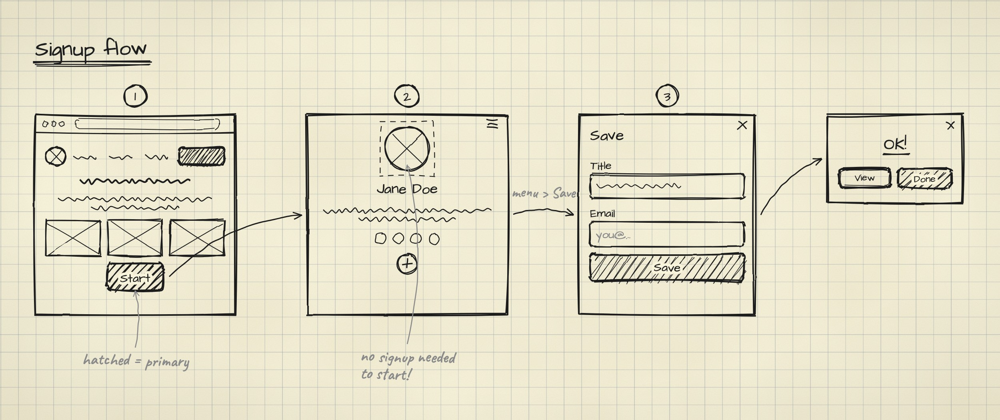
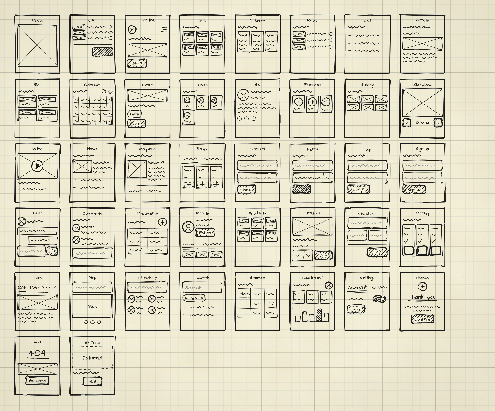
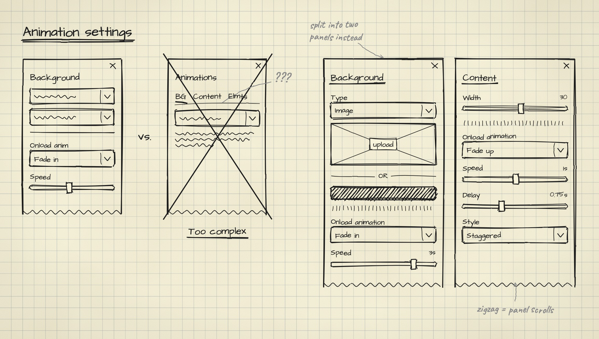

# sketch

Hand-drawn, lo-fi UX deliverables from a sentence: user flows, screens, component sheets, sitemaps, journey maps,
iterations and responsive sets, drawn like black felt-tip on cream paper. Your agent writes a small JSON spec and
a deterministic renderer draws it, so the same spec always produces the same image.



| Command | You get |
|---|---|
| `flow` | a user journey: screens left→right, curved arrows, numbered steps |
| `screen` | one screen up close, every part explained in the margin |
| `sheet` | a component library page |
| `iterate` | option A vs B, the rejected one struck out with its verdict, the refined one larger |
| `redesign` | CURRENT vs NEW rows with the rationale in the margins |
| `sitemap` | page thumbnails in a tree, numbered badges + legend |
| `journey` | customer journey map: phases, actions, emotion curve, touchpoints, opportunities |
| `trace` | any live page redrawn as a wireframe, compiled from a frozen snapshot, no guessing |
| `responsive` | one page at desktop, tablet and phone, side by side |
| `photo` | a finished sketch turned into a photo of a notebook page (optional) |

Plus 42 page archetypes (pricing, checkout, dashboard, calendar…) for thumbnails in flows and sitemaps:



<table><tr>
<td></td>
<td></td>
</tr><tr>
<td></td>
<td></td>
</tr></table>

## Setup

Copy or symlink this folder into your agent's skills directory, then install its renderer once (Node 18+):

```bash
npm install
npx playwright-core install chromium
```

## Use

```text
/sketch flow — signup for a scheduling app: landing, pick a plan, create account, onboarding
/sketch sitemap for a design studio site; badge the pages we're adding and explain why
/sketch journey — first-time buyer, 4 phases, the low point is shipping costs at checkout
/sketch trace https://example.com, then responsive
```

Everything also works from the command line. See `SKILL.md` and `references/spec-schema.md`:

```bash
node scripts/render.mjs examples/flow.json -o flow.png --strict              # .png · .jpg · .svg
node scripts/snapshot.mjs https://example.com -o home.snap.json               # trace: capture once…
node scripts/trace.mjs home.snap.json -o home.json                            # …compile by fixed rules
node scripts/responsive.mjs https://example.com -o out/home                   # three widths, one board
npm test                                                                      # determinism + layout checks
```

## Credits

The style is inspired by the planning notes AJ shared in
[The Making of Carrd](https://themakingof.carrd.co/#extras-notes). It is drawn from scratch, and no reference
images are included. Bundles [rough.js](https://roughjs.com) (MIT) and the Architects Daughter, Caveat and Nanum
Pen Script fonts (SIL OFL 1.1); their licenses are in `scripts/vendor/`.
